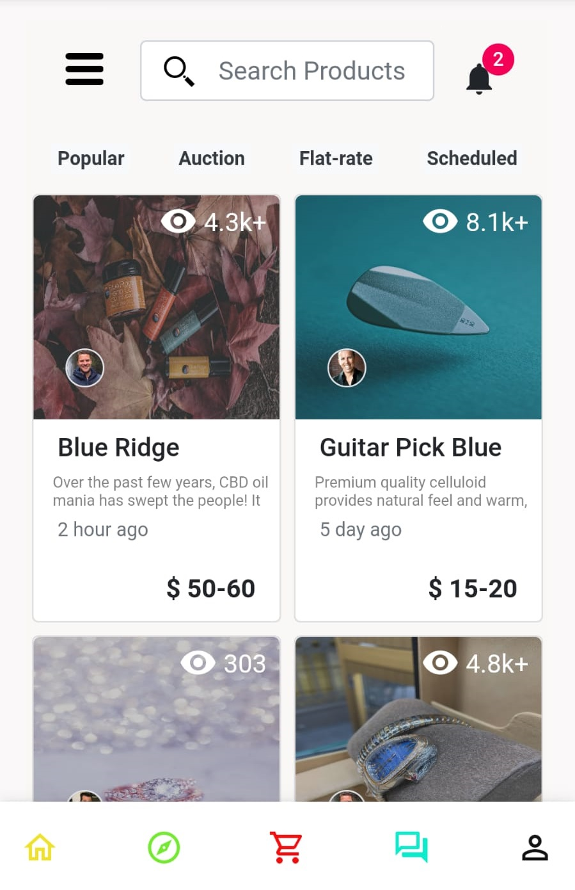

# Hello Mohamed hope you are doing well.
Task done which has usable filter (Popular, Auction, Flat-rate, Scheduled) and Search Bar.
Popular badge covers more than 8000 by filtering and sorts from higher to lower number.
Auction, Flat-rate, Scheduled badges filters according to "salesMethod" parameter in api.
I added a badge to card of product so that the filters can be viewed better.

To search for the product name, start typing in the search bar, not need to submit button.
I use private ".env" file but I added ".env.example" file in GitHub which has REACT_APP_baseURL because maybe you want to check data of api (https://app.apiary.io/kocakilyas/)


# Yoripe Task

Setup and run : ```npm i  &&  npm start``` -  ```http://localhost:3000/```

<h3>Yoripe developed with React, Redux and Node.js</h3>
<br/>
<h6>Demo                : https://yoripe.netlify.app/ </h6>
<h6>Repository          : https://github.com/kocak-ilyas/yoripe.git </h6>
<hr/>
<h5>Contact:</h5>
<h6>Linkedin            : https://www.linkedin.com/in/ilyaskocak</h6>
<h6>Gmail               : kocakilyas18@gmail.com </h6>
<h6>GitHub              : https://github.com/kocak-ilyas</h6>
<h6>Mobile Number       : +90 537 305 1855  - I am using WhatsApp and Skype -</h6>
<hr/>

# Mobile Screen
